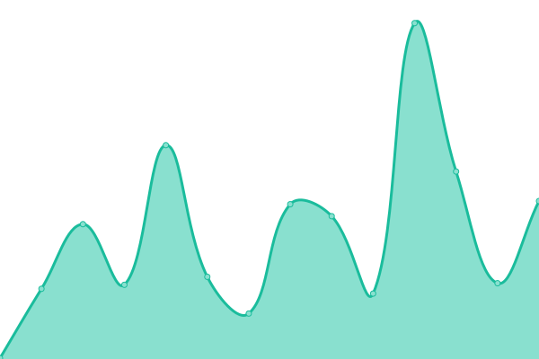
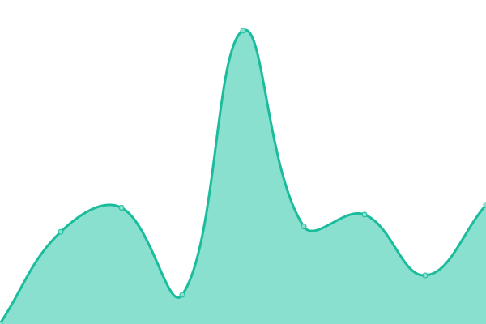

# [📈 Live Status](https://aerolution.github.io/upptime): <!--live status--> **🟧 Partial outage**

This repository contains the open-source uptime monitor and status page for [<3](hallowdynes.xyz), powered by [Upptime](https://github.com/upptime/upptime).

With [Upptime](https://upptime.js.org), you can get your own unlimited and free uptime monitor and status page, powered entirely by a GitHub repository. We use [Issues](https://github.com/aerolution/upptime/issues) as incident reports, [Actions](https://github.com/aerolution/upptime/actions) as uptime monitors, and [Pages](https://aerolution.github.io/upptime) for the status page.

<!--start: status pages-->
<!-- This summary is generated by Upptime (https://github.com/upptime/upptime) -->
<!-- Do not edit this manually, your changes will be overwritten -->
<!-- prettier-ignore -->
| URL | Status | History | Response Time | Uptime |
| --- | ------ | ------- | ------------- | ------ |
|  [Landing site](https://katlyn.cloud) | 🟥 Down | [landing-site.yml](https://github.com/aerolution/upptime/commits/HEAD/history/landing-site.yml) | 

 145ms
     
 | 

<a href="https://status.katlyn.cloud/history/landing-site">100.00%</a>
    

|  [Personal Image Host](https://murderer.katlyn.cloud) | 🟥 Down | [personal-image-host.yml](https://github.com/aerolution/upptime/commits/HEAD/history/personal-image-host.yml) | 

 144ms
     
 | 

<a href="https://status.katlyn.cloud/history/personal-image-host">100.00%</a>
    

|  [Blog](https://blog.katlyn.cloud) | 🟩 Up | [blog.yml](https://github.com/aerolution/upptime/commits/HEAD/history/blog.yml) | 

 290ms
     
 | 

<a href="https://status.katlyn.cloud/history/blog">100.00%</a>
    

|  [Private Beta Host (Unreleased)](https://pics.katlyn.cloud) | 🟥 Down | [private-beta-host-unreleased.yml](https://github.com/aerolution/upptime/commits/HEAD/history/private-beta-host-unreleased.yml) | 

 64ms
     
 | 

<a href="https://status.katlyn.cloud/history/private-beta-host-unreleased">100.00%</a>
    

<!--end: status pages-->

[**Visit our status website →**](https://aerolution.github.io/upptime)

## 📄 License

- Powered by: [Upptime](https://github.com/upptime/upptime)
- Code: [MIT](./LICENSE) © [<3](hallowdynes.xyz)
- Data in the `./history` directory: [Open Database License](https://opendatacommons.org/licenses/odbl/1-0/)
